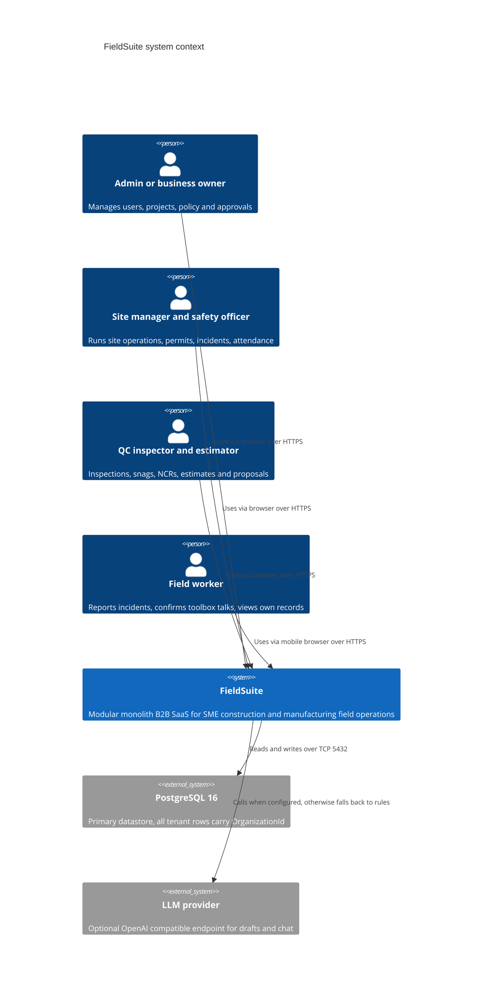
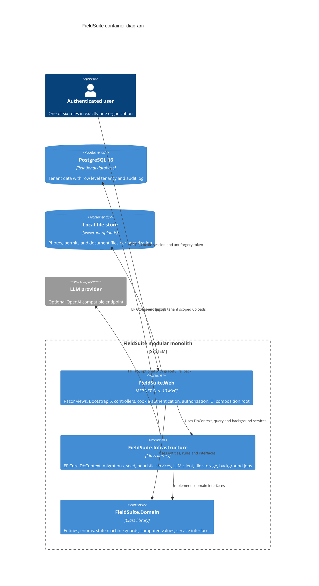
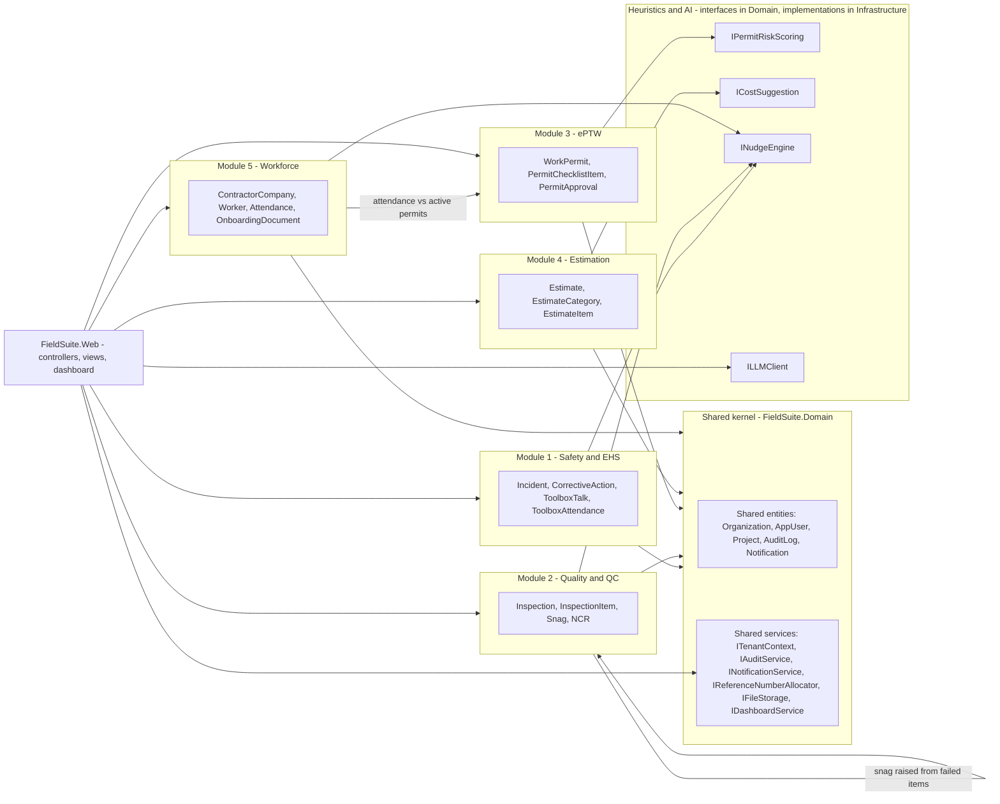
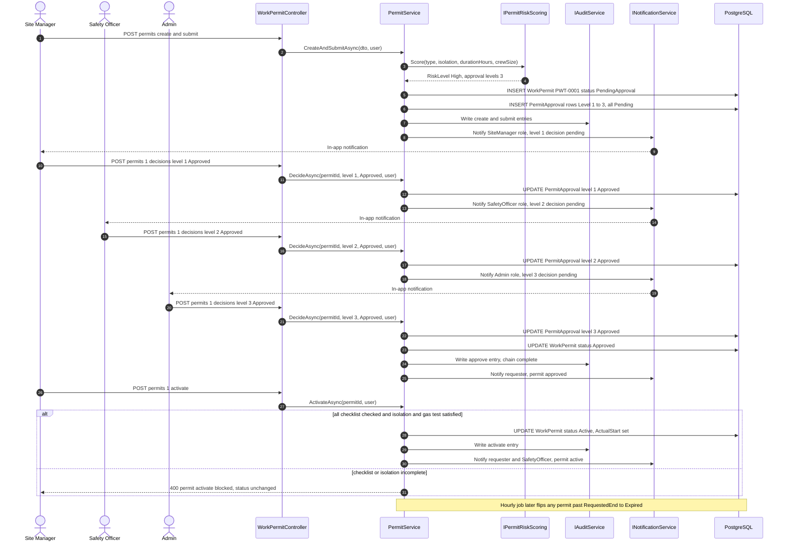
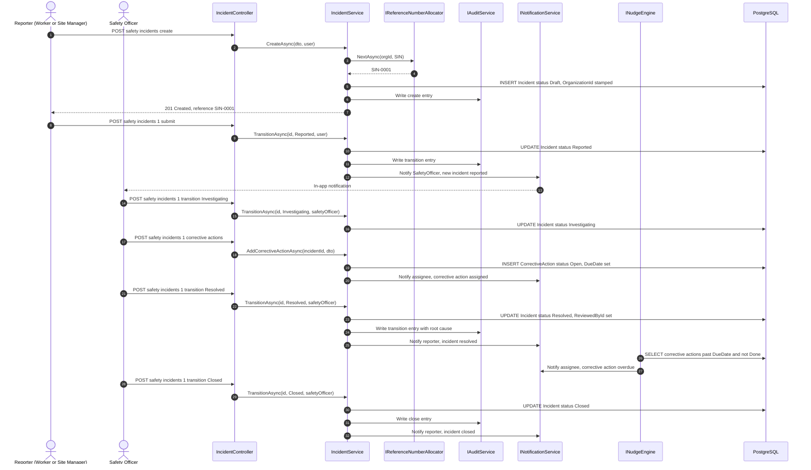
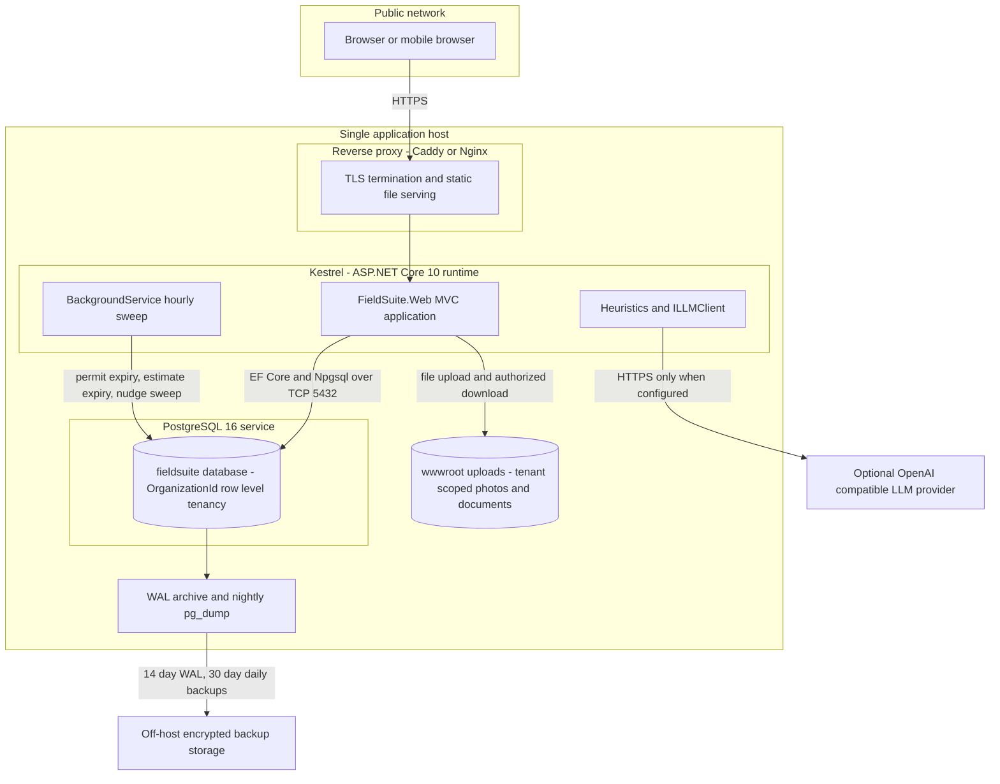

# FieldSuite - Architecture Diagrams

All diagrams are Mermaid. They render on GitHub, in VS Code (Markdown Preview Mermaid Support), and in any Mermaid-compatible viewer. Blocks are kept syntactically simple: quoted node labels, single-word ER relationship labels, and no exotic syntax.

| # | Diagram | Type |
|---|---|---|
| 1 | System context | `C4Context` |
| 2 | Container diagram | `C4Container` |
| 3 | Module diagram | `flowchart` |
| 4 | Entity relationship diagram (all entities) | `erDiagram` |
| 5 | Sequence - permit approval flow | `sequenceDiagram` |
| 6 | Sequence - incident report flow | `sequenceDiagram` |
| 7 | Deployment diagram | `flowchart` |

---

## 1. C4 Context - users, FieldSuite, external systems

## 2. C4 Container - Web, Infrastructure, Domain, database

## 3. Module diagram - five modules plus shared kernel

## 4. ERD - all entities and relations

```mermaid
erDiagram
    Organization {
        int Id PK
        string Name
        datetime CreatedAt
    }
    AppUser {
        string Id PK
        int OrganizationId FK
        string FullName
        string Role
        string UserName
        string Email
    }
    Project {
        int Id PK
        int OrganizationId FK
        string Name
        string Code
        string ClientName
        string Address
        date StartDate
        date EndDate
        string Status
        bool IsActive
    }
    AuditLog {
        int Id PK
        int OrganizationId FK
        string UserId FK
        string Action
        string EntityType
        string EntityId
        string Detail
        datetime Timestamp
    }
    Notification {
        int Id PK
        int OrganizationId FK
        string UserId FK
        string Message
        string Link
        bool IsRead
        datetime CreatedAt
    }
    Incident {
        int Id PK
        int OrganizationId FK
        int ProjectId FK
        string Reference
        string Type
        string Severity
        string Title
        string Description
        datetime OccurredAt
        string Location
        string RootCause
        string ReportedById FK
        string Status
        string ReviewedById FK
    }
    CorrectiveAction {
        int Id PK
        int IncidentId FK
        string Description
        string AssignedToId FK
        date DueDate
        string Status
    }
    ToolboxTalk {
        int Id PK
        int ProjectId FK
        string Topic
        date TalkDate
        int DurationMinutes
        string FacilitatorId FK
        string Notes
    }
    ToolboxAttendance {
        int Id PK
        int ToolboxTalkId FK
        int WorkerId FK
    }
    Inspection {
        int Id PK
        int ProjectId FK
        string Reference
        string Type
        string Title
        date InspectionDate
        string InspectorId FK
        string Status
        string OverallNotes
    }
    InspectionItem {
        int Id PK
        int InspectionId FK
        string ChecklistText
        string Result
        string Comment
    }
    Snag {
        int Id PK
        int ProjectId FK
        string Reference
        string Title
        string Description
        string Location
        string Priority
        string RaisedById FK
        string AssignedToId FK
        date DueDate
        string PhotoPath
        string Status
        datetime ClosedAt
    }
    NCR {
        int Id PK
        int ProjectId FK
        string Reference
        string Title
        string Severity
        string Description
        date DetectedDate
        string ContainmentAction
        string Status
    }
    WorkPermit {
        int Id PK
        int OrganizationId FK
        int ProjectId FK
        string Reference
        string Type
        string Title
        string Description
        string Location
        string RequestedById FK
        datetime RequestedStart
        datetime RequestedEnd
        string RiskLevel
        string Status
        bool IsolationVerified
        bool GasTestRequired
        string SpecialConditions
        datetime ActualStart
        datetime ActualEnd
    }
    PermitChecklistItem {
        int Id PK
        int WorkPermitId FK
        string Text
        bool IsChecked
        string CheckedById FK
        datetime CheckedAt
    }
    PermitApproval {
        int Id PK
        int WorkPermitId FK
        int Level
        string ApproverRole
        string ApproverId FK
        string Decision
        string Comment
        datetime DecidedAt
    }
    Estimate {
        int Id PK
        int OrganizationId FK
        int ProjectId FK
        string Reference
        string Title
        string ClientName
        string Status
        date ValidUntil
        string Notes
        string CreatedById FK
        datetime CreatedAt
        decimal MarginPercent
    }
    EstimateCategory {
        int Id PK
        int EstimateId FK
        string Name
        int SortOrder
    }
    EstimateItem {
        int Id PK
        int EstimateCategoryId FK
        string Description
        decimal Quantity
        string Unit
        decimal UnitRate
        decimal WastePercent
    }
    ContractorCompany {
        int Id PK
        int OrganizationId FK
        string Name
        string ContactPerson
        string Phone
        string Email
        string Trade
        bool IsActive
    }
    Worker {
        int Id PK
        int OrganizationId FK
        int ContractorCompanyId FK
        string FullName
        string JobTitle
        string Phone
        string Email
        date HireDate
        string Shift
        bool IsActive
    }
    Attendance {
        int Id PK
        int WorkerId FK
        int ProjectId FK
        date WorkDate
        datetime ClockIn
        datetime ClockOut
        decimal HoursWorked
        string Status
        string Notes
    }
    OnboardingDocument {
        int Id PK
        int WorkerId FK
        string Type
        string DocumentNumber
        date IssuedDate
        date ExpiryDate
        string FilePath
    }

    Organization ||--o{ AppUser : has
    Organization ||--o{ Project : owns
    Organization ||--o{ AuditLog : holds
    Organization ||--o{ Notification : queues
    Organization ||--o{ WorkPermit : issues
    Organization ||--o{ Estimate : sponsors
    Organization ||--o{ ContractorCompany : engages
    Organization ||--o{ Worker : employs
    AppUser ||--o{ AuditLog : writes
    AppUser ||--o{ Notification : receives
    AppUser ||--o{ Incident : reports
    AppUser ||--o{ Incident : reviews
    AppUser ||--o{ CorrectiveAction : assigned
    AppUser ||--o{ ToolboxTalk : facilitates
    AppUser ||--o{ Inspection : inspects
    AppUser ||--o{ Snag : raises
    AppUser ||--o{ Snag : resolves
    AppUser ||--o{ WorkPermit : requests
    AppUser ||--o{ PermitChecklistItem : verifies
    AppUser ||--o{ PermitApproval : decides
    AppUser ||--o{ Estimate : creates
    Project ||--o{ Incident : contains
    Project ||--o{ ToolboxTalk : hosts
    Project ||--o{ Inspection : schedules
    Project ||--o{ Snag : generates
    Project ||--o{ NCR : flags
    Project ||--o{ WorkPermit : authorizes
    Project |o--o{ Estimate : scopes
    Project ||--o{ Attendance : gathers
    Incident ||--o{ CorrectiveAction : tracks
    ToolboxTalk ||--o{ ToolboxAttendance : records
    Worker ||--o{ ToolboxAttendance : attends
    Inspection ||--o{ InspectionItem : lists
    WorkPermit ||--o{ PermitChecklistItem : holds
    WorkPermit ||--o{ PermitApproval : requires
    Estimate ||--o{ EstimateCategory : groups
    EstimateCategory ||--o{ EstimateItem : comprises
    ContractorCompany |o--o{ Worker : hires
    Worker ||--o{ Attendance : logs
    Worker ||--o{ OnboardingDocument : carries
```

Notes:

- Every child row carries its own `OrganizationId` (directly or through a parent) for row-level tenancy; the diagram shows it explicitly where the specification lists it.
- `ToolboxAttendance.WorkerId` and `Attendance.WorkerId` reference the `Worker` entity (Module 5); all other `...ById` fields reference `AppUser`.
- `Estimate.ProjectId` and `Worker.ContractorCompanyId` are optional (zero-or-one on the parent side).

## 5. Sequence - permit approval flow

## 6. Sequence - incident report flow

## 7. Deployment diagram

## 8. Rendering checklist

- Each block is fenced as `mermaid`.
- C4 blocks use `C4Context` / `C4Container` with `title`, `Person`, `System`, `System_Boundary`, `Container`, `ContainerDb`, `System_Ext`, `Rel`.
- ERD relationship labels are single lowercase words; optional parents use `|o--o{`.
- Sequence diagrams declare all participants up front and close every `alt` with `end`.
- Flowchart subgraphs are quoted (`subgraph ID["Label"]`) and every `subgraph` has a matching `end`.
